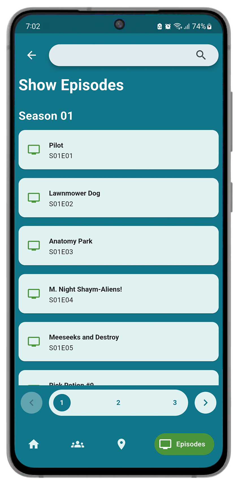

# Rick and Morty Demo App

This demo app showcases the utilization of the [Rick and Morty API](http://rickandmortyapi.com/). Developed utilizing the Flutter framework, the app seamlessly integrates with the GraphQL API.

The decision to employ GraphQL over REST was deliberate, driven by its capacity to precisely retrieve essential data. This not only minimizes bandwidth consumption on mobile devices but also streamlines the process of querying associated data through a singular query, effectively curbing the frequency of interactions with the server.

## Libraries

This app uses the following Libraries:

- [Flutter SVG](https://pub.dev/packages/flutter_svg)
- [Google Nav Bar](https://pub.dev/packages/google_nav_bar)
- [GraphQL](https://pub.dev/packages/graphql)
- [Provider](https://pub.dev/packages/provider)
- [YAML](https://pub.dev/packages/yaml)

## Screenshots

 

 

 

 
